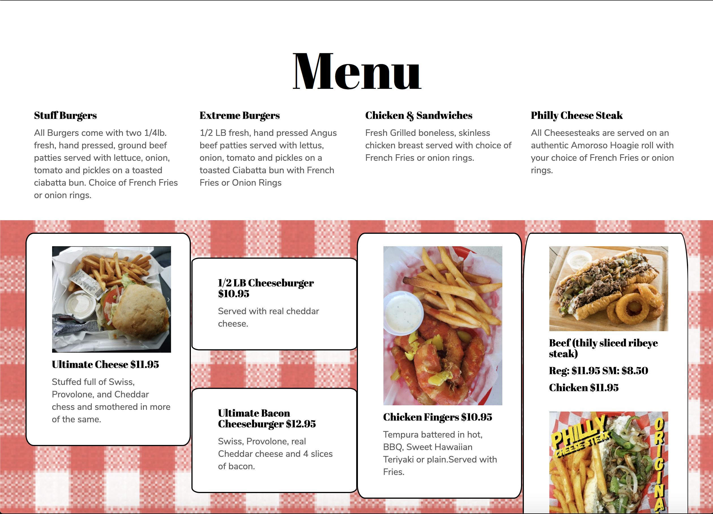

# Philly Kings Project & Tutorial

[Test the HTML Website](https://cryptopotluck.github.io/philly-kings/)

[Find the Full Tutorial on the Potluck App](http://pipinstallpython.com:8000/)

[Need Help? Jump into the Python Discord](http://pipinstallpython.com:8000/)

This is a simple hosting project I designed to teach students the basics to HTML templates as they are a pre-requisite for larger dynamic application. 

I streamed the lesson & I was able to get the project built custom in 3h worth of time. 

I saved $646 on the project by building without a middle men.

## What is included in this Project
1. Simple Real Project Template
2. Base Starter Template
2. Google Analytics Setup Tutorial
3. How to Add Custom Scripts
4. Custom CSS
5. Custom Photo Editing 

### 2020 Research Findings on HTML Hosting
Wix
---
Cost: $792 / 3 Years

Host Gator
---
[Cost: $146 /  3 Years]('https://www.hostgator.com/)

Nas
---
[Total Investment of Nas Server](http://www.pipinstallpython.com:8000/shop/11)

# Template Sites I Recommend
[BootStrap Templates](https://themes.getbootstrap.com/)

[Creative Tim](https://www.creative-tim.com/)

